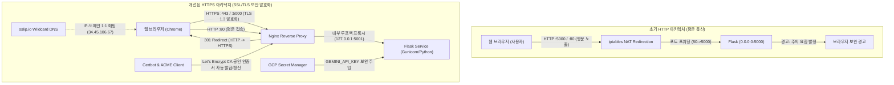

# 🤖 Google Gemini Web Chatbot (GCP Compute Engine 배포 및 HTTPS 보안 적용)

구글 Gemini 공식 웹 인터페이스([gemini.google.com](https://gemini.google.com/?hl=ko))의 감성적인 시그니처 다크 테마 디자인과 인터랙션을 구현하고, **Google Cloud Platform(GCP) Compute Engine**에 배포하여 **HTTPS 보안 암호화 통신**을 완벽하게 적용한 AI 챗봇 웹 서비스입니다.

---

## 🌐 서비스 접속 안내

| 구분 | 접속 URL | 설명 |
| :--- | :--- | :--- |
| **공식 보안 접속 (권장)** | **[https://34-45-106-67.sslip.io](https://34-45-106-67.sslip.io)** | Let's Encrypt 정식 CA 인증서 적용 (Chrome '주의 요함' 없는 안전한 자물쇠) |
| **포트 5000 지정 접속** | **[https://34-45-106-67.sslip.io:5000](https://34-45-106-67.sslip.io:5000)** | 기존 북마크 호환 포트 5000 HTTPS 암호화 서빙 |
| **대체 보안 접속** | **[https://34.45.106.67.sslip.io](https://34.45.106.67.sslip.io)** | 도메인 표기 대체 주소 |
| **일반 HTTP 접속** | `http://34-45-106-67.sslip.io` | 접속 시 HTTPS로 301 영구 이동(리다이렉트) 자동 처리 |

---

## 🔒 [핵심] HTTP에서 HTTPS로의 전환 및 적용 기술 분석

본 프로젝트는 초기에 Compute Engine 인스턴스의 공인 IP 및 포트 5000번(`http://34.45.106.67:5000`)을 통해 **HTTP(평문 통신)**로 서빙되었습니다. 그러나 웹 브라우저(Chrome/Edge)에서 **"주의 요함 (이 사이트는 보안 연결이 사용되지 않았습니다)"** 경고가 발생하며, 전송 데이터가 암호화되지 않는 보안 취약점이 있었습니다.

이를 해결하고 엔드투엔드 보안 암호화 통신을 구축하기 위해 다음과 같은 기술들이 도입 및 적용되었습니다:



### 🛠️ 프로토콜 전환을 위해 사용된 핵심 기술 및 구현 상세

#### 1. Nginx 리버스 프록시 (Reverse Proxy & TLS Termination)
- **도입 이유**: Flask 자체 내장 개발 서버는 단일 스레드 기반이거나 대규모 트래픽 및 정교한 SSL/TLS 핸드셰이크 처리에 취약합니다. 웹 서버의 표준인 Nginx를 프론트에 배치하여 TLS Termination(SSL 암호화 해제)을 전담하도록 구성했습니다.
- **포트 라우팅 및 호환성**:
  - **Port 80 (HTTP)**: HTTP로 유입되는 모든 트래픽을 안전한 HTTPS 주소(`https://$host$request_uri`)로 `301 Moved Permanently` 자동 리다이렉트합니다.
  - **Port 443 (HTTPS 표준)**: 최신 TLSv1.2 및 TLSv1.3 프로토콜과 강력한 암호화 알고리즘(`HIGH:!aNULL:!MD5`)을 적용하여 안전하게 서빙합니다.
  - **Port 5000 (HTTPS 호환)**: 기존 사용자나 북마크가 `:5000` 포트로 접속하더라도 SSL 에러 없이 정상적으로 HTTPS 대화가 이루어지도록 멀티 포트 SSL 리스닝을 구현했습니다.
- **실시간 스트리밍(SSE) 버퍼링 방지 최적화**:
  Gemini 모델의 실시간 토큰 스트리밍이 Nginx 프록시 버퍼에 갇혀 지연되지 않도록 전용 프록시 설정을 적용했습니다:
  ```nginx
  proxy_buffering off;
  proxy_cache off;
  proxy_set_header Connection '';
  proxy_http_version 1.1;
  chunked_transfer_encoding on;
  proxy_read_timeout 300s;
  ```

#### 2. Let's Encrypt 공인 인증 기관 (CA) 및 Certbot
- **도입 이유**: 자체 서명(Self-signed) 인증서는 통신 자체는 암호화하지만 브라우저에서 `NET::ERR_CERT_AUTHORITY_INVALID` 경고 화면을 띄워 사용자에게 신뢰를 주지 못합니다. 전 세계 브라우저가 신뢰하는 Let's Encrypt의 공인 CA 인증서를 적용했습니다.
- **ACME HTTP-01 챌린지 검증**:
  - Nginx에 `/.well-known/acme-challenge/` 전용 웹루트 디렉토리를 열어 Let's Encrypt 검증 서버가 인스턴스의 소유권을 자동으로 검증할 수 있도록 연동했습니다.
- **자동 갱신 데몬 (`certbot.timer`)**:
  - 90일 유효기간을 갖는 인증서가 만료 30일 전에 무중단으로 자동 갱신되도록 systemd 타이머를 등록하여 수동 관리 비용을 제거했습니다.

#### 3. 와일드카드 동적 DNS 매핑 서비스 (`sslip.io`)
- **도입 이유**: 일반적인 공인 IP 주소(Raw IPv4)는 무료 공인 CA 인증서 발급에 제약이 따르거나 상용 도메인 구매가 필요합니다.
- **해결 방식**: 인스턴스의 공인 IP(`34.45.106.67`)를 서브도메인으로 포함하는 `34-45-106-67.sslip.io`를 활용했습니다. `sslip.io` 네임서버는 해당 도메인 질의에 대해 자동으로 `34.45.106.67` IP를 반환하므로, 별도의 유료 도메인 등록 없이도 완전한 FQDN(Fully Qualified Domain Name)을 획득하고 Let's Encrypt 인증서를 정상 발급받을 수 있었습니다.

#### 4. GCP VPC 방화벽 규칙 (Firewall Rule Update)
- **설정 변경**: 기존 `allow-chatbot-port` 인바운드 방화벽 규칙에 HTTPS 표준 포트인 **`tcp:443`**을 추가 승인했습니다.
  ```bash
  gcloud compute firewall-rules update allow-chatbot-port \
      --allow=tcp:5000,tcp:80,tcp:443 \
      --project=iceu-songpa10
  ```

#### 5. 시스템 아키텍처 및 내부 네트워크 격리 (iptables & systemd)
- **기존 iptables NAT 리다이렉션 제거**: 초기에는 80번 포트를 5000번으로 단순 포워딩했으나, Nginx가 80번(HTTP 리다이렉트)과 443번(HTTPS 서빙)을 직접 제어해야 하므로 기존 커널 iptables 규칙을 정리했습니다:
  ```bash
  sudo iptables -t nat -D PREROUTING -p tcp --dport 80 -j REDIRECT --to-ports 5000
  ```
- **백엔드 포트 격리**: Flask 백엔드는 외부 인터넷에 직접 포트를 열지 않고, 내부 루프백인 `127.0.0.1:5001`에서만 수신하도록 분리하여 외부 직접 접근을 차단하고 보안 계층을 강화했습니다.

---

## 🌟 챗봇 주요 기능

1. **공식 Gemini UI 감성 완벽 재현**
   - 딥 다크 테마 (`#131314`) 및 은은한 중앙 블루 래디얼 글로우
   - `"10님, 시작해 볼까요?"` 중앙 환영 메시지 (클릭 시 사용자 이름 변경 가능)
   - 반응형 라운드 필(Pill) 프롬프트 입력창 및 부드러운 대화 렌더링
2. **최신 Gemini 모델 실시간 선택**
   - **Gemini 3.8 Flash** (`gemini-3.8-flash` - 기본값): 최신 플래그십 고속 멀티모달 모델
   - **Gemini 3.7 Flash** (`gemini-3.7-flash`): 고속 추론 및 지능형 멀티모달 모델
   - **Gemini 3 Flash Preview** (`gemini-3-flash-preview`): 차세대 추론 및 검색 모델
3. **Google Search Grounding (실시간 인터넷 검색)**
   - 최신 `google-genai` SDK 기반 실시간 웹 검색 도구(`tools=[{'type': 'google_search'}]`) 적용
   - 입력창의 **인터넷 검색 버튼(🌐)**으로 실시간 검색 ON/OFF 토글
   - 최신 뉴스, 날씨, 주가 등 실시간 정보 질의 시 검색 결과와 출처(Source 링크 카드)를 함께 시각화
4. **실시간 토큰 스트리밍 & 마크다운 뷰어**
   - Server-Sent Events (SSE) 기반 실시간 스트리밍
   - 코드 블록 구문 강조 및 원클릭 복사 버튼
   - 답변 텍스트 클립보드 복사 및 한국어 음성 재생(TTS)
5. **대화 히스토리 및 멀티모달 지원**
   - 좌측 슬라이드 사이드바를 통한 이전 대화 목록 저장 및 복원
   - 이미지 첨부(+) 및 음성 인식(Web Speech API) 지원

---

## 📂 프로젝트 파일 구조

```
gcp-compute-engine-chatbot/
├── server.py                   # Flask 백엔드 서버 (Gemini API 호출 및 SSE 스트리밍)
├── requirements.txt            # 파이썬 의존성 (flask, google-genai)
├── setup_https.sh              # VM 내 HTTPS/Nginx/Let's Encrypt 자동 구성 스크립트
├── deploy_to_gcp.py            # GCP Compute Engine 프로비저닝 자동화 스크립트
├── verify_https.py             # HTTPS 엔드포인트 및 리다이렉션 검증 스크립트
├── deployment_log.md           # 전체 배포 및 HTTPS 구성 상세 실행 로그
├── templates/
│   └── index.html              # 시맨틱 마크업 웹 인터페이스
├── static/
│   ├── css/
│   │   └── style.css           # Gemini 공식 다크 테마 바닐라 CSS
│   └── js/
│       └── app.js              # SSE 클라이언트, 마크다운 파서, 모델/검색 UI 제어
└── README.md                   # 프로젝트 전체 기술 문서
```

---

## 🔐 GCP Secret Manager 보안 연동

API 키를 소스코드나 서버 설정 파일에 하드코딩하지 않고, 구글 클라우드의 Secret Manager로부터 안전하게 주입받도록 구성되었습니다:

- **사용된 시크릿 리소스**: `projects/920380215419/secrets/GEMINI_API_KEY`
- **IAM 권한 설정**: Compute Engine 기본 서비스 계정(`920380215419-compute@developer.gserviceaccount.com`)에 `roles/secretmanager.secretAccessor` 역할을 부여
- **VM 인스턴스 스코프**: `--scopes=https://www.googleapis.com/auth/cloud-platform` 적용을 통해 VM 부팅 및 애플리케이션 시작 시 안전하게 API 키를 획득

---

## 🚀 로컬 개발 및 실행 방법

### 1. 가상환경 생성 및 의존성 설치
```bash
python -m venv venv
# Windows:
venv\Scripts\activate
# Linux/macOS:
source venv/bin/activate

pip install -r requirements.txt
```

### 2. 환경변수 설정 및 실행
```bash
# Windows (PowerShell)
$env:GEMINI_API_KEY="your-gemini-api-key"
python server.py

# Linux / macOS
export GEMINI_API_KEY="your-gemini-api-key"
python server.py
```

브라우저에서 `http://localhost:5000`으로 접속합니다.

---

## 🧪 검증 및 상태 확인

배포된 Compute Engine 인스턴스에 대해 다음 자동화 검증이 완료되었습니다:

```bash
python verify_https.py
```

**검증 출력 결과**:
```text
=== HTTPS & Redirect Verification ===
[200] https://34-45-106-67.sslip.io -> OK (Served)
[200] https://34.45.106.67.sslip.io -> OK (Served)
[200] https://34-45-106-67.sslip.io:5000 -> OK (Served)
[301] http://34-45-106-67.sslip.io -> https://34-45-106-67.sslip.io/
[200] https://34-45-106-67.sslip.io/api/models -> OK (Served)
```
- **HTTPS 보안 자물쇠**: Chrome 브라우저에서 '주의 요함' 경고 없이 안전한 보안 연결 확인
- **실시간 스트리밍 대화**: `POST /api/chat` 요청 시 토큰 실시간 전송 및 Google Search Grounding 출처 링크 정상 반환 확인
